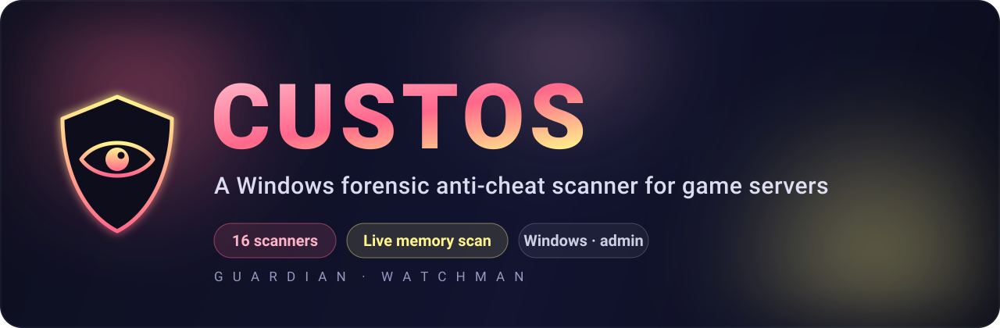

<div align="center">



**A Windows forensic anti-cheat scanner for game servers.**

<br/>

[](https://github.com/dybeky/custos/releases)
[](https://github.com/dybeky/custos/actions/workflows/ci.yml)
[](https://github.com/dybeky/custos/releases)
[](LICENSE)

<br/>

**Find the traces cheats leave behind — even after they're deleted.**

Custos reads the artifacts Windows quietly records every time a program runs, and checks them against the fingerprints of known cheats. It never touches the game — it only *reads* what your system already stored.

<br/>

[**What it is**](#what-is-custos)&nbsp;&nbsp;·&nbsp;&nbsp;[**Before you start**](#before-you-start)&nbsp;&nbsp;·&nbsp;&nbsp;[**Install**](#install-custos)&nbsp;&nbsp;·&nbsp;&nbsp;[**First scan**](#your-first-scan-step-by-step)&nbsp;&nbsp;·&nbsp;&nbsp;[**Results**](#reading-your-results)&nbsp;&nbsp;·&nbsp;&nbsp;[**Live Scan**](#live-scan-advanced)&nbsp;&nbsp;·&nbsp;&nbsp;[**Scanners**](#what-each-scanner-checks)

</div>

---

## What is Custos?

When someone runs a program on Windows — including a cheat — the operating system quietly records that it happened in dozens of different places: prefetch files, registry keys, recent‑files lists, an execution log called BAM, the DNS cache, and more. These records often survive **even after the program itself is deleted.**

Custos is a desktop app that reads those records, looks for fingerprints of known cheats, and hands you a clean, exportable report. It does **not** hook into the game or modify anything on the player's PC.

> [!IMPORTANT]
> **Findings are *traces*, not proof.** A finding means "something matched a known pattern and is worth a closer look" — never "this person is guilty." Always treat results as evidence to investigate. See [Responsible use](#responsible-use).

<table>
<tr>
<th align="left">Forensic scan</th>
<th align="left">Live Scan</th>
</tr>
<tr>
<td valign="top" width="50%">

Reads Windows history & artifacts to find traces of **past** cheat use.

This is the **main** feature — 16 scanners, no game required.

</td>
<td valign="top" width="50%">

Inspects the **running** game's memory in real time for active tampering.

Advanced and optional — needs the game open.

</td>
</tr>
</table>

---

## Before you start

> A 30‑second checklist before your first scan.

| Requirement | Why it matters |
|---|---|
| **Windows only** | Custos reads Windows‑specific artifacts. It won't run on macOS or Linux. |
| **Run as Administrator** | The most useful artifacts (Prefetch, BAM, process command lines) are protected. Without admin rights those scanners return "access denied" and you get an incomplete picture. |
| **Get consent** | Only scan a machine when the player has agreed, or when your server rules clearly require forensic review as a condition of play. |

---

## Install Custos

1. Open the releases page → **[github.com/dybeky/custos/releases](https://github.com/dybeky/custos/releases)**
2. Download the portable build that matches the PC's processor — no installation needed:

   | File | For |
   |---|---|
   | **`custos-x64.exe`** | Regular Intel/AMD PCs — the right choice for almost everyone. |
   | **`custos-arm64.exe`** | Windows-on-ARM devices (e.g. Snapdragon laptops). |

3. Run the file. Custos asks for **Administrator rights automatically** (a standard Windows UAC prompt) — it needs them to read protected artifacts like Prefetch and BAM.
4. **Pick a game** when prompted (Unturned is supported today; Counter‑Strike 2 is marked *coming soon*).

That's it — you're ready to scan.

> [!TIP]
> Not sure which build you grabbed? If the x64 build runs on an ARM PC, the Dashboard shows a **"Running under emulation"** notice with a link to the right file.

---

## A quick tour of the app

Custos has a slim **icon‑only sidebar** down the left edge. Hover any icon to see its name.

| Page | What you use it for |
|---|---|
| **Dashboard** | Home screen — app version, what your system supports, and a live changelog. |
| **Scan** | The main event: runs all forensic scanners with live progress. |
| **Live Scan** | Advanced — inspects the running game's memory (Windows + game open). |
| **Results** | Review and export findings. A badge shows the total count. |
| **Manual** | One‑click shortcuts to open Windows folders, registry keys, and references. |
| **Utilities** | Links to trusted third‑party forensic tools. |
| **Settings** | Language (English / Русский) and appearance. |

---

## Your first scan (step by step)

This is the core workflow. It takes under a minute.

**1.** Open the **Scan** page (the magnifying‑glass icon).

**2.** The page shows how many scanners are ready. Click the big **Start Scan** button in the center.

**3.** Watch the progress:
- A **circular indicator** shows overall completion as a percentage.
- **Every scanner is listed** with its live state:
  - **Pending** — waiting its turn
  - **Active** — currently running
  - **Done** — finished (a **count badge** replaces the checkmark when it found something)

**4.** When everything finishes, the status reads **Scan Complete** with the total number of findings.

**5.** Head to **Results** to review what was found.

> [!TIP]
> **Not sure what a scanner does?** Hover the small **ⓘ icon** next to any scanner name — on the Scan, Results, Live Scan, and Utilities pages — for a plain‑language explanation of what it inspects and why it matters.

> [!TIP]
> **Need to stop early?** Click **Cancel Scan** at any time. Custos stops cleanly and never leaves a scan stuck running. Scanners run in smart batches with a built‑in time limit, so one slow scanner can't freeze the whole run.

---

## Reading your results

Open the **Results** page after a scan.

#### The summary card

<table>
<tr>
<td width="50%" valign="top">

**Green** — no findings detected.

</td>
<td width="50%" valign="top">

**Red, with a count** — findings exist and deserve a look.

</td>
</tr>
</table>

#### Per‑scanner findings

Below the summary, each scanner gets its own **collapsible card**. Click to expand and see that scanner's individual findings — file paths, registry values, or other strings — in an easy‑to‑read monospace font. Each card also shows how long that scanner took.

> [!WARNING]
> **A finding is a lead, not a conviction.** A matched keyword might be a real cheat — or a file with a coincidentally similar name, an old leftover, or something harmless. Read the actual path or value, weigh the context, and corroborate across more than one scanner before drawing a conclusion.

#### Exporting your report

| Button | File | Best for |
|---|---|---|
| **Export Results** | `custos-scan-YYYY-MM-DD.txt` | A quick, human‑readable summary to paste into a ticket or chat. |
| **Export JSON** | `custos-scan-YYYY-MM-DD.json` | A structured file (scanner name, success flag, findings, duration, errors) for records or further processing. |

---

## Live Scan (advanced)

**Live Scan** is a separate, optional feature that inspects the **running game's memory** for active tampering — injected modules, code hooks, suspicious threads, and more.

For it to be available, **all four** must be true:

```
1.  You're on Windows
2.  The native memory module is installed   (see "Native module" below)
3.  The game is currently running
4.  Custos is running as Administrator
```

The page shows a status banner telling you exactly where you stand — *Checking Status*, *Windows Only*, *Native Unavailable*, *Game Not Running*, or **Ready**. When it says **Ready**, start the scan and Custos streams each detector's progress and findings live. Every finding is labeled with a confidence level — **high**, **suspicious**, or **info** — to help you prioritize.

> [!NOTE]
> If Live Scan is unavailable, that's fine — every forensic scanner on the main **Scan** page still works without it.

---

## What each scanner checks

A full forensic scan runs **16 scanners**.

<details open>
<summary><b>The 16 scanners — what each one inspects</b></summary>

<br/>

| # | Scanner | What it looks at |
|:--:|---|---|
| 1 | **AppData** | AppData folders, searched by known cheat keywords. |
| 2 | **Prefetch** | The Windows Prefetch folder, which records what programs have run. |
| 3 | **Recent Files** | The list of recently accessed files. |
| 4 | **Game Folder** | The game's installation directories. |
| 5 | **Registry** | Keys that track program use (MuiCache, AppSwitched, ShowJumpView). |
| 6 | **Browser History** | Browser history and caches by keyword (e.g. visits to cheat sellers). |
| 7 | **Process** | Currently running processes, with their paths and command lines. |
| 8 | **Steam** | Steam accounts and folders. |
| 9 | **Amcache** | A Windows store of program execution history. |
| 10 | **BAM/DAM** | The Background Activity Moderator log — recently executed programs. |
| 11 | **Shellbags** | Records of which folders have been opened. |
| 12 | **VM** | Signs the machine is a virtual machine or sandbox (a common way to hide). |
| 13 | **DNS Cache** | The Windows DNS cache, for suspicious domain lookups. |
| 14 | **Scheduled Tasks** | The Task Scheduler, for entries used to keep cheats running (persistence). |
| 15 | **File Hash** | SHA‑256 fingerprints of files in Downloads/Desktop/Temp vs. known cheat hashes. |
| 16 | **Window & Module** | Window titles and loaded modules of running programs vs. the keyword list. |

</details>

---

## Extra tools: Manual & Utilities

These two pages support hands‑on investigation when you want to look around yourself.

<details>
<summary><b>Manual — one‑click shortcuts (6 categories)</b></summary>

<br/>

- **System Tools** — Windows settings shortcuts: *Data Usage* and *Windows Defender*.
- **Folders** — opens common directories in File Explorer: *Videos, Downloads, AppData, LocalAppData, Prefetch, OneDrive*.
- **Games** — opens the default *Unturned* and *Steam* install folders.
- **Registry** — opens key forensic registry paths directly in regedit (MuiCache, AppSwitched, ShowJumpView, AppBadgeUpdated, AppLaunch, RunMRU, UserAssist, AppCompatFlags, Compatibility Assistant Store).
- **Telegram Cheat Bots** — reference links to known Unturned cheat‑seller bots, for context.
- **Additional Resources** — reference links to common cheat marketplaces (Oplata.info, FunPay.com).

</details>

<details>
<summary><b>Utilities — trusted third‑party tools</b></summary>

<br/>

Clicking a tool opens its official download page in your browser:

- **LastActivityView** (NirSoft) — a timeline of recent system activity.
- **USBDeview** (NirSoft) — history of USB devices that have been plugged in.
- **Everything** (voidtools) — instant filesystem search.
- **System Informer** — advanced process and system inspection.
- **ShellBag Analyzer & Cleaner** (Privazer) — dedicated shellbag inspection.

</details>

---

## Settings

The **Settings** page has two sections:

- **Language** — switch the entire interface between **English** and **Русский** instantly. Every page, scanner description, tooltip, and live‑scan finding is fully translated.
- **Appearance** — Custos uses a single black‑and‑white palette with warm coffee accents; this section shows the brand colours.

> [!NOTE]
> Earlier versions had a “Danger Zone” that could delete the app after a scan. That feature has been **removed** — Custos no longer deletes itself or any of your files.

---

## Responsible use

> [!CAUTION]
> Custos is a powerful tool. Please use it responsibly.

- **Findings are leads, not proof.** A trace means "investigate further," never "guilty." Don't ban on a single keyword match.
- **Get consent.** Only run Custos where the player has agreed, or where your server rules explicitly authorise forensic review as a condition of play.
- **Respect the law and your jurisdiction.** Informed consent and your local rules come first.
- **Custos requires Administrator rights** to read protected Windows artifacts. It is intended solely for legitimate moderation of game servers.

---

## Build from source

<details>
<summary><b>For developers and contributors</b></summary>

<br/>

*If you just want to use Custos, grab the installer from [Releases](https://github.com/dybeky/custos/releases) instead.*

Custos is an Electron app built with **React, TypeScript, Vite, Tailwind CSS, and Zustand**.

```bash
git clone https://github.com/dybeky/custos.git
cd custos
npm install

# development mode (hot-reload)
npm run dev

# production build for Windows (x64 portable)
npm run package:win

# Windows-on-ARM portable
npm run package:win:arm64
```

- **Requirements:** Node.js 20+. The final packaged build needs a Windows environment (or a `windows-latest` CI runner).
- **Cross‑platform checks:** `npm run typecheck` and `npm run build` work on any OS.
- **Tests:** `npm test` (Vitest). Coverage via `npm run test:coverage`.

**Native module (Windows only).** Live Scan depends on `memoryjs`, a native addon compiled against Electron's ABI. On Windows, run this after `npm install`:

```bash
npm run rebuild
```

On non‑Windows hosts you can skip it — Live Scan reports "native unavailable," but **all 16 forensic scanners remain fully functional.**

</details>

---

<div align="center">

**Custos** — *guardian · watchman*

Requires Administrator rights to read protected Windows artifacts. Intended solely for legitimate moderation of game servers — use it only on machines where you have the player's informed consent, or where your server rules explicitly authorise forensic review.

<sub>Made for game server admins · [MIT License](LICENSE)</sub>

</div>
