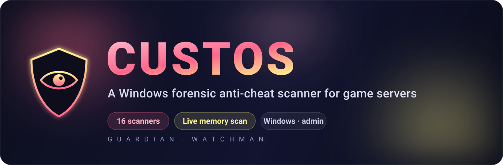

<div align="center">



**A Windows forensic anti-cheat scanner for game servers.**

<br/>

[](https://github.com/dybeky/custos/releases)
[](https://github.com/dybeky/custos/actions/workflows/ci.yml)
[](https://github.com/dybeky/custos/releases)
[](LICENSE)

<br/>

**Find the traces cheats leave behind — even after they're deleted.**

Custos reads the artifacts Windows quietly records every time a program runs, and checks them against the fingerprints of known cheats. It never touches the game — it only *reads* what your system already stored.

<br/>

[**What it is**](#what-is-custos)&nbsp;&nbsp;·&nbsp;&nbsp;[**Before you start**](#before-you-start)&nbsp;&nbsp;·&nbsp;&nbsp;[**Install**](#install-custos)&nbsp;&nbsp;·&nbsp;&nbsp;[**First scan**](#your-first-scan-step-by-step)&nbsp;&nbsp;·&nbsp;&nbsp;[**Results**](#reading-your-results)&nbsp;&nbsp;·&nbsp;&nbsp;[**Live Scan**](#live-scan-advanced)&nbsp;&nbsp;·&nbsp;&nbsp;[**Scanners**](#what-each-scanner-checks)

</div>

---

## What is Custos?

When someone runs a program on Windows — including a cheat — the operating system quietly records that it happened in dozens of different places: prefetch files, registry keys, recent‑files lists, an execution log called BAM, the DNS cache, and more. These records often survive **even after the program itself is deleted.**

Custos is a desktop app that reads those records, looks for fingerprints of known cheats, and hands you a clean, exportable report. It does **not** hook into the game or modify anything on the player's PC.

> [!IMPORTANT]
> **Findings are *traces*, not proof.** A finding means "something matched a known pattern and is worth a closer look" — never "this person is guilty." Always treat results as evidence to investigate. See [Responsible use](#responsible-use).

<table>
<tr>
<th align="left">Forensic scan</th>
<th align="left">Live Scan</th>
</tr>
<tr>
<td valign="top" width="50%">

Reads Windows history & artifacts to find traces of **past** cheat use.

This is the **main** feature — 21 scanners, no game required.

</td>
<td valign="top" width="50%">

Inspects the **running** game's memory in real time for active tampering.

Advanced and optional — needs the game open.

</td>
</tr>
</table>

---

## Before you start

> A 30‑second checklist before your first scan.

| Requirement | Why it matters |
|---|---|
| **Windows only** | Custos reads Windows‑specific artifacts. It won't run on macOS or Linux. |
| **Run as Administrator** | The most useful artifacts (Prefetch, BAM, process command lines) are protected. Without admin rights those scanners return "access denied" and you get an incomplete picture. |
| **Get consent** | Only scan a machine when the player has agreed, or when your server rules clearly require forensic review as a condition of play. |

---

## Install Custos

1. Open the releases page → **[github.com/dybeky/custos/releases](https://github.com/dybeky/custos/releases)**
2. Download the portable build that matches the PC's processor — no installation needed:

   | File | For |
   |---|---|
   | **`custos-x64.exe`** | Regular Intel/AMD PCs — the right choice for almost everyone. |
   | **`custos-arm64.exe`** | Windows-on-ARM devices (e.g. Snapdragon laptops). |

3. Run the file. Custos asks for **Administrator rights automatically** (a standard Windows UAC prompt) — it needs them to read protected artifacts like Prefetch and BAM.
4. **Pick a game** when prompted (Unturned is supported today; Counter‑Strike 2 is marked *coming soon*).

That's it — you're ready to scan.

> [!TIP]
> Not sure which build you grabbed? If the x64 build runs on an ARM PC, the Dashboard shows a **"Running under emulation"** notice with a link to the right file.

---

## A quick tour of the app

Custos has a slim **icon‑only sidebar** down the left edge. Hover any icon to see its name.

| Page | What you use it for |
|---|---|
| **Dashboard** | Home screen — app version, what your system supports, and a live changelog. |
| **Scan** | The main event: runs all forensic scanners with live progress. |
| **Live Scan** | Advanced — inspects the running game's memory (Windows + game open). |
| **Results** | Review and export findings. A badge shows the total count. |
| **Manual** | One‑click shortcuts to open Windows folders, registry keys, and references. |
| **Utilities** | Links to trusted third‑party forensic tools. |
| **Settings** | Interface (Classic / Focus), color theme (4) and your 97437.dev account. |

---

## Your first scan (step by step)

This is the core workflow. It takes under a minute.

**1.** Open the **Scan** page (the magnifying‑glass icon).

**2.** The page shows how many scanners are ready. Click the big **Start Scan** button in the center.

**3.** Watch the progress:
- A **circular indicator** shows overall completion as a percentage.
- **Every scanner is listed** with its live state:
  - **Pending** — waiting its turn
  - **Active** — currently running
  - **Done** — finished (a **count badge** replaces the checkmark when it found something)

**4.** When everything finishes, the status reads **Scan Complete** with the total number of findings.

**5.** Head to **Results** to review what was found.

> [!TIP]
> **Not sure what a scanner does?** Hover the small **ⓘ icon** next to any scanner name — on the Scan, Results, Live Scan, and Utilities pages — for a plain‑language explanation of what it inspects and why it matters.

> [!TIP]
> **Need to stop early?** Click **Cancel Scan** at any time. Custos stops cleanly and never leaves a scan stuck running. Scanners run in smart batches with a built‑in time limit, so one slow scanner can't freeze the whole run.

---

## If Custos won't start or crashes

Custos explains the problem instead of closing silently. It names a cause only when it is certain, and offers a download only when one install fixes it:

| What happened | What Custos shows |
|---|---|
| Microsoft Visual C++ runtime missing | The cause + a button to Microsoft's official download page |
| Wrong build for the processor, mismatched or damaged files | The cause + a button to the latest Custos release |
| Graphics driver crashed | Restarts with hardware acceleration off (remembered), + your GPU vendor's driver page when known |
| Disk full, access denied, out of memory, window crashed | The cause and what to do |
| Anything else | "Unexpected error" with the exact error text and a **Show log file** button — never a guessed fix |

A corrupted settings file no longer prevents Custos from starting — it is reset automatically.

## Two interfaces: Classic and Focus

Pick one in **Settings → Interface** — it switches instantly and is remembered.

| | **Classic** | **Focus** (new) |
|---|---|---|
| Layout | Icon sidebar, separate Scan and Results pages | One top bar; the whole check on a single screen |
| During a scan | Progress ring | Progress ring + a live grid of all 21 checks (waiting / running / done / failed) |
| Results | Stacked cards | Verdict rail (risk gauge, reason, coverage, case, export) beside a workspace with **Evidence / Timeline / Checks** tabs, severity grouping, filters and search |
| Keyboard | — | **Ctrl+K** command palette · **Ctrl+Enter** start a check · **Ctrl+E** export the report |

Both interfaces share the same scanners, verdicts, triage and exports.

## Reading your results

Open the **Results** page after a scan.

#### The risk verdict

At the top, Custos grades the whole scan — **Clean · Low · Medium · High · Critical** — with a 0–100 score and a one‑line reason. The grade is deliberately conservative:

| What was found | Verdict |
|---|---|
| Nothing, or only system information (Steam accounts, VM details) | **Clean** |
| A single name match with nothing to confirm it | **Low** — likely a coincidence |
| Several unrelated leads | **Medium** |
| The same cheat seen in **2** independent kinds of artifacts (e.g. Prefetch + AppData) | **High** |
| The same cheat seen in **3+** kinds of artifacts, or a file matching a known cheat's hash | **Critical** |

If any check could not finish — usually "access denied" because Custos was not run as Administrator — an amber warning says so. Treat a **Clean** result with an incomplete check list as unproven, and rescan with admin rights.

#### Key evidence

When one cheat signature shows up across several independent checks, it is listed under **Key evidence** with every check that saw it. This is the strongest kind of lead Custos produces — start your investigation here.

#### Activity timeline

Every lead that carries a time — a program's last run (Prefetch), execution records (BAM), site visits, event‑log clears, cleaner runs — is laid out newest first, with how long before the scan it happened. Activity from the **24 hours before the check** is highlighted: a cheat's last run followed minutes later by CCleaner is exactly the pattern to ask about.

#### Case details

The **Case** card records who you are checking (nickname or SteamID — Steam accounts found on the PC fill it in one click), your notes, and your Custos account as *checked by*. All of it goes at the top of the exported report.

#### Per‑scanner findings

Below, each scanner gets its own **collapsible card**. Click to expand and see its individual findings — file paths, registry values, or other strings — each tagged with a severity. The badge shows how many leads a scanner produced: **red** for evidence, **grey** for system information only, **amber "!"** when the check did not complete (the reason is shown under its name).

Hover a finding to act on it:

| Action | Effect |
|---|---|
| **Show in folder** | Selects the file in Explorer — it is never opened or run. |
| **False positive** | Excludes the finding from this scan's verdict (it stays visible, struck through, with **Restore**). |
| **Always ignore "…"** | Stops counting that signature on every future scan — for a legitimate program that shares a cheat's name. Ignored signatures are listed on the Results page and can be removed with one click. |

The verdict, counts, key evidence, timeline and exports update instantly — nothing is rescanned.

> [!WARNING]
> **A finding is a lead, not a conviction.** A matched keyword might be a real cheat — or a file with a coincidentally similar name, an old leftover, or something harmless. Read the actual path or value, weigh the context, and corroborate across more than one scanner before drawing a conclusion.

#### History and re-checks

Every check is saved on this PC automatically (the latest 100) — open **History** to search by player, reopen a past report (read‑only) or delete it. When you check a player again — matched by the SteamID64 in the **Player** field, or by name — a **Compared to the previous check** card shows the verdict then vs. now and exactly which leads are **new** and which are **gone** since last time.

#### Exporting your report

| Button | File | Best for |
|---|---|---|
| **Export Results** | `custos-YYYY-MM-DD-<scan id>.txt` | A complete, human‑readable report — scan ID, date, game, system, verdict and reasons, key evidence, graded findings, which checks ran or failed, and an integrity hash. Paste it into a ticket or attach it to an appeal. |
| **Export JSON** | `custos-YYYY-MM-DD-<scan id>.json` | The full analyzed report plus the raw per‑scanner output, in a versioned format (`custos-scan-report` v1) for records or tooling. |

Every report carries a **SHA‑256 integrity hash**. It is computed over the JSON `report` object without its `contentHash` field (`JSON.stringify` of the object as exported), so anyone holding the JSON can recompute it and confirm the report was not edited after the scan.

---

## Live Scan (advanced)

**Live Scan** is a separate, optional feature that inspects the **running game's memory** for active tampering — injected modules, code hooks, suspicious threads, and more.

For it to be available, **all four** must be true:

```
1.  You're on Windows
2.  The native memory module is installed   (see "Native module" below)
3.  The game is currently running
4.  Custos is running as Administrator
```

The page shows a status banner telling you exactly where you stand — *Checking Status*, *Windows Only*, *Native Unavailable*, *Game Not Running*, or **Ready**. When it says **Ready**, start the scan and Custos streams each detector's progress and findings live. Every finding is labeled with a confidence level — **high**, **suspicious**, or **info** — to help you prioritize.

> [!NOTE]
> If Live Scan is unavailable, that's fine — every forensic scanner on the main **Scan** page still works without it.

---

## What each scanner checks

A full forensic scan runs **21 scanners**.

<details open>
<summary><b>The 21 scanners — what each one inspects</b></summary>

<br/>

| # | Scanner | What it looks at |
|:--:|---|---|
| 1 | **AppData** | AppData folders, searched by known cheat keywords. |
| 2 | **Prefetch** | The Windows Prefetch folder, which records what programs have run. |
| 3 | **Recent Files** | The list of recently accessed files. |
| 4 | **Game Folder** | The game's installation directories. |
| 5 | **Registry** | Keys that track program use (MuiCache, AppSwitched, ShowJumpView). |
| 6 | **Browser History** | Browser history and caches by keyword (e.g. visits to cheat sellers). |
| 7 | **Process** | Currently running processes, with their paths and command lines. |
| 8 | **Steam** | Steam accounts and folders. |
| 9 | **Amcache** | A Windows store of program execution history. |
| 10 | **BAM/DAM** | The Background Activity Moderator log — recently executed programs. |
| 11 | **Shellbags** | Records of which folders have been opened. |
| 12 | **VM** | Signs the machine is a virtual machine or sandbox (a common way to hide). |
| 13 | **DNS Cache** | The Windows DNS cache, for suspicious domain lookups. |
| 14 | **Scheduled Tasks** | The Task Scheduler, for entries used to keep cheats running (persistence). |
| 15 | **File Hash** | SHA‑256 fingerprints of files in Downloads/Desktop/Temp vs. known cheat hashes. |
| 16 | **Window & Module** | Window titles and loaded modules of running programs vs. the keyword list. |
| 17 | **Anti‑Forensics** | Signs traces were removed before the check (Prefetch disabled or wiped, event logs cleared in the last 14 days, trace cleaners run in the last 3 days) **and Windows components switched off so checks can't run**: checking tools blocked via Image File Execution Options or DisallowRun, Task Manager / Registry Editor / Command Prompt disabled by policy, Event Log / BAM / DNS Client disabled, reg.exe blocked, or USB device history wiped from the registry. Legit setups (Process Explorer replacing Task Manager, parental game blocks) are ignored. Raises the verdict to at least **Medium**, or **High** if cheat leads remain. |
| 18 | **Defender History** | Windows Defender's own detections of game cheats / cheat tools (GameHack, CheatEngine…) — threat, path, time, action — kept even after the file is gone. Windows activators and keygens are ignored. A Defender cheat identification alone means at least **High**. |
| 19 | **Recycle Bin** | Deleted files named like a known cheat, with their original path, exact deletion time, and whether they can still be restored. |
| 20 | **USB History** | Every USB storage device ever connected, with first and last connection times — shown as context in the timeline. |
| 21 | **USN Journal** | The NTFS change journal: every file that ever had a cheat‑like name — created, renamed (full chain, e.g. `aimbot.dll → update.dll`), written, deleted — with its last activity time. Needs admin rights. |

</details>

---

## Extra tools: Manual & Utilities

These two pages support hands‑on investigation when you want to look around yourself.

<details>
<summary><b>Manual — one‑click shortcuts (6 categories)</b></summary>

<br/>

- **System Tools** — Windows settings shortcuts: *Data Usage* and *Windows Defender*.
- **Folders** — opens common directories in File Explorer: *Videos, Downloads, AppData, LocalAppData, Prefetch, OneDrive*.
- **Games** — opens the default *Unturned* and *Steam* install folders.
- **Registry** — opens key forensic registry paths directly in regedit (MuiCache, AppSwitched, ShowJumpView, AppBadgeUpdated, AppLaunch, RunMRU, UserAssist, AppCompatFlags, Compatibility Assistant Store).
- **Telegram Cheat Bots** — reference links to known Unturned cheat‑seller bots, for context.
- **Additional Resources** — reference links to common cheat marketplaces (Oplata.info, FunPay.com).

</details>

<details>
<summary><b>Utilities — trusted third‑party tools</b></summary>

<br/>

Clicking a tool opens its official download page in your browser:

- **LastActivityView** (NirSoft) — a timeline of recent system activity.
- **USBDeview** (NirSoft) — history of USB devices that have been plugged in.
- **Everything** (voidtools) — instant filesystem search.
- **System Informer** — advanced process and system inspection.
- **ShellBag Analyzer & Cleaner** (Privazer) — dedicated shellbag inspection.

</details>

---

## Settings

The **Settings** page has three sections:

- **Interface** — choose **Classic** or **Focus** (see [Two interfaces](#two-interfaces-classic-and-focus)); the switch is instant and remembered.
- **Color theme** — **Espresso** (warm coffee‑noir, the default), **Graphite** (cool blue), **Emerald** (mint green) or **Violet** (lavender). Works in both interfaces, switches instantly, and is remembered — even the window background at launch matches.
- **Account** — sign in with your 97437.dev account (optional). Your name is then recorded as *checked by* on exported reports.

Custos is English‑only. Scanners still read artifacts from Windows in any display language (for example, `ipconfig` output on a Russian‑language Windows is parsed correctly).

> [!NOTE]
> Earlier versions had a “Danger Zone” that could delete the app after a scan. That feature has been **removed** — Custos no longer deletes itself or any of your files.

---

## Responsible use

> [!CAUTION]
> Custos is a powerful tool. Please use it responsibly.

- **Findings are leads, not proof.** A trace means "investigate further," never "guilty." Don't ban on a single keyword match.
- **Get consent.** Only run Custos where the player has agreed, or where your server rules explicitly authorise forensic review as a condition of play.
- **Respect the law and your jurisdiction.** Informed consent and your local rules come first.
- **Custos requires Administrator rights** to read protected Windows artifacts. It is intended solely for legitimate moderation of game servers.

---

## Build from source

<details>
<summary><b>For developers and contributors</b></summary>

<br/>

*If you just want to use Custos, grab the installer from [Releases](https://github.com/dybeky/custos/releases) instead.*

Custos is an Electron app built with **React, TypeScript, Vite, Tailwind CSS, and Zustand**.

```bash
git clone https://github.com/dybeky/custos.git
cd custos
npm install

# development mode (hot-reload)
npm run dev

# production build for Windows (x64 portable)
npm run package:win

# Windows-on-ARM portable
npm run package:win:arm64
```

- **Requirements:** Node.js 20+. The final packaged build needs a Windows environment (or a `windows-latest` CI runner).
- **Cross‑platform checks:** `npm run typecheck` and `npm run build` work on any OS.
- **Tests:** `npm test` (Vitest). Coverage via `npm run test:coverage`.

**Native module (Windows only).** Live Scan depends on `memoryjs`, a native addon compiled against Electron's ABI. On Windows, run this after `npm install`:

```bash
npm run rebuild
```

On non‑Windows hosts you can skip it — Live Scan reports "native unavailable," but **all 21 forensic scanners remain fully functional.**

</details>

---

<div align="center">

**Custos** — *guardian · watchman*

Requires Administrator rights to read protected Windows artifacts. Intended solely for legitimate moderation of game servers — use it only on machines where you have the player's informed consent, or where your server rules explicitly authorise forensic review.

<sub>Made for game server admins · [MIT License](LICENSE)</sub>

</div>
